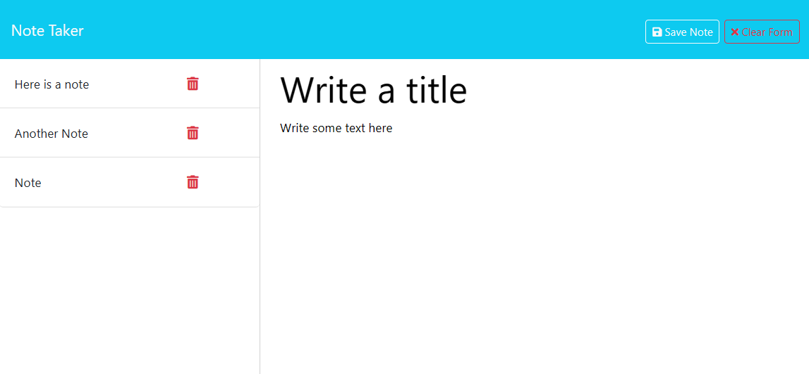

# Note Taker

## Description

An application to write and save notes.
View the deployed application here: https://note-taker-kyel.onrender.com 

## Usage

The following screenshot shows the note taker application:

To view and add notes, from the homepage, click the "Get Started" button. To add a new note, click the "Note Title" and "Note Text" and add text. To start over, click the "Clear Form" button. When you are done, click the "Save Note" button. The note title will display in the sidebar to the left. Click on a title to view the corresponding note.